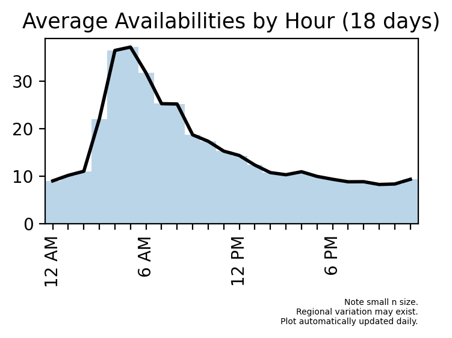

# OVERVIEW

This repo allows you to scrape the web for real-time COVID-19 vaccine
availabilities at CVS locations in your area. You can choose the driving
radius, the frequency with which to pull new data, as well as whether to
use sound to alert you to availabilities (because they fill up quickly!),
then leave the script running and it will periodically write the latest
availabilities to a file.

The files will be written to the following directory:

    `./past_availabilities`

The name of each file will reflect the time/date that it was written. Each
will contain the following fields:

    `city   |   state   |   zip   |   distance (miles)`

These fields will help you move quickly to secure your appointment. See
the last two sections of this README for instructions on how to do this.

# SETUP

This repo requires the use of a conda environment.

To set up a named env, run the following command:

    `conda env create -f environment.yaml --name <name>`

To set up a prefixed env, run the following command:

    `conda env create -f environment.yaml --prefix <prefix>`

Next, generate a file containing metadata on cities you are willing to drive
to to receive a vaccination. To do so, first activate the environment you
just created:

    `conda activate <name>/<prefix>`

Then run the following command:

    `python ./utils/compute_distances_from_me.py <your_zip_code> <driving_radius>`

`your_zip_code` is the 5-number postal code for your home address.
`driving_radius` is an integer value specifying how far (in miles) you are
willing to drive from your home. Both arguments are required.

This command will output the following file:

    `./utils/uszips_mine.csv`

Among other things, this file enumerates the distance from your location to
each city within your specified driving radius. Note that these distances are
approximate, and will become increasingly inaccurate as they become larger
due to the Earth's curvature and, occasionally, the aggregation of multiple
related zip codes. Their purpose is simply to facilitate rapid decision-making
by roughly rank-ordering your results by proximity to you.

Do not change this file's name or location. If you ever want to modify your
driving radius, just regenerate the file with the new radius.

# HOW TO SCRAPE FOR AVAILABLITIES

To scrape for availabilities, first activate your environment:

    `conda activate <name>/<prefix>`

Next, run the following script and simply leave the process running:

    `python ./scrape.py`

Optional arguments:

    `-h`, `--help`            show this help message and exit
    `-i`, `--interval_mins`   integer duration in minutes to sleep between
                              scrapes (default: 10)
    `-q`, `--quiet`           surpress sounds, except those announcing
                              availabilities at new locations (default: False)
    `-Q`, `--quiet_all`       surpress all sounds (default: False)

This will scrape the web for availabilities periodically on an infinite
loop. Whenever availabilities are found, they are written to a file, and
sounds are played to catch your attention unless optionally surpressed
(remember, these availabilities often disappear within minutes!). The first
sound (*cha-ching!*) plays whenever any availabilities are detected. The
second sound (jovial horns) then plays if any of the availabilities just
detected were not present in the prevous scrape; Such availabilies will be
newer and thus more likely to stll exist.

To halt scraping, press `CTRL + C`.

# I'VE FOUND AVAILABILITIES. NOW WHAT?

Note that the data being scraped is updated frequently, but is not always
accurate to the minute. This is because the data is updated in batches,
and new availabilities fill up very quickly. So when you hear the horns
indicating new availabilities (or equivalently, if you notice new rows
in the output file), **ACT FAST!!!**

To that end, when new availabilities are detected, follow these steps
promptly:

1. **PICK A LOCATION:** Open the latest output file (identifiable via the
timestamp in the filename). The rows will be ordered by distance from you,
ascending. **Pick a location from this list, copy its zip code, and note
the state**.

2. **SEARCH FOR AVAILABILITIES:** To confirm that the scraped availability
data is still current, visit this site:

    https://www.cvs.com/immunizations/covid-19-vaccine

Scroll down and select the state of the location you picked in Step 1.
In the popup, you should see a link "Schedule an appointment now." If not,
that means the state no longer has availabilities, so return to Step 1 and
pick another location. If you do see the link, select it, and answer the
questions on the subsequent pages.

3. **SELECT A CVS LOCATION AND MAKE RESERVATION:** After the third page of
questions, you will come to a page with "Determine eligibility" at the top.
In the dropdown, select the state corresponding to the state you selected
in Step 2. Then answer the questions. Eventually you will come to a page
where you can search for CVS locations in that state by zip code. Paste the
zip code copied in Step 1 into the search field. **If there are no results,
that means the availabilities at that location have all filled up.** In
that case, return to the output file, select a different zip code, and
paste it into this page, repeating until you get results. **If there are
any results, that means there are still avalabilities in that area.** Select
a location and an appointment time in order to lock in your reservation.

**Note**: If the location you selected is administering one of the vaccinations
that require multiple doses, you will be given the option to schedule both shots.

# TIPS ON FINDING APPOINTMENTS

1. **Time of day matters. A lot.**

While organization and luck are significant factors, time of day is the most
significant determiner of success. The number of available appointments spikes
in the AM hours, likely because most people are asleep so competition is less
fierce. So short of leaving the scraper running all day long, to maximize your
odds of success it is highly recommended to run it late at night and/or first
thing in the morning, and act immediately. The early bird catches the worm after
all :)

2. **Have your insurance information ready.**

CVS requires you to enter your medical and prescription insurance information
in order to secure an appointment. If someone else finishes entering their
information before you do, the avaliability may disappear. So have this
information near at hand whenever this scraper is running.

# Good luck!!
